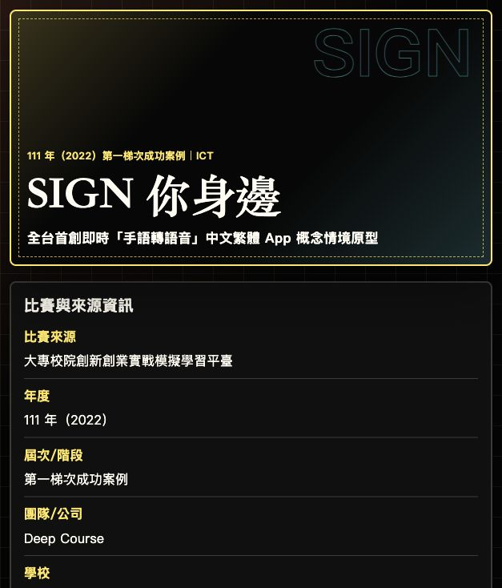
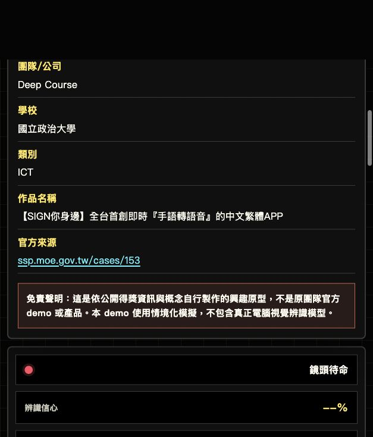

# SIGN 你身邊：手語轉語音情境翻譯 App Demo

## 快速看懂

- 線上 Demo：https://atlasforcn.github.io/startup-sign-companion-translator/
- 這個原型在做什麼：把 SIGN 你身邊做成手語轉語音情境翻譯 App。
- 特色定位：特色是高對比、可讀性優先，清楚呈現辨識狀態、翻譯文字與播報佇列。
- 操作流程：模擬開啟鏡頭與手勢辨識 → 選擇手勢片段並產生即時翻譯 → 加入語音播報佇列與對話紀錄

展開完整功能流程截圖

這是一個可直接用瀏覽器開啟的靜態興趣原型，實作「【SIGN你身邊】全台首創即時『手語轉語音』的中文繁體APP」概念。Demo 以高對比、可讀性優先的互動介面呈現，模擬手語片段辨識、即時中文翻譯、語音播報佇列、常用語快速卡、對話紀錄與無障礙設定。

## 比賽與來源資訊

- 比賽來源：大專校院創新創業實戰模擬學習平臺
- 年度：111 年（2022）
- 屆次/階段：第一梯次成功案例
- 團隊/公司：Deep Course
- 學校：國立政治大學
- 類別：ICT
- 作品名稱：【SIGN你身邊】全台首創即時『手語轉語音』的中文繁體APP
- 官方來源：https://ssp.moe.gov.tw/cases/153

## 免責聲明

這是依公開得獎資訊與概念自行製作的興趣原型，不是原團隊官方 demo 或產品。本 demo 使用情境化模擬，不包含真正電腦視覺辨識模型。

## 使用方式

直接開啟 `index.html` 即可使用，適合 GitHub Pages 或任何靜態檔案伺服環境。

1. 按下「啟動模擬鏡頭」進入辨識狀態。
2. 選擇一個手勢片段，或按「模擬辨識」讓系統挑選片段。
3. 在「即時翻譯文字」檢查輸出內容。
4. 將文字加入「語音播報佇列」，再播放或逐筆移除。
5. 使用常用語快速卡、對話紀錄與無障礙設定模擬現場溝通流程。

## 功能範圍

- 鏡頭與辨識狀態模擬
- 手勢片段選擇與信心分數展示
- 即時翻譯文字區與複製功能
- 瀏覽器語音合成播報，若瀏覽器不支援則顯示文字狀態
- 語音播報佇列
- 常用語快速卡
- 對話紀錄
- 大字模式、降低動態、語速調整、字幕提示、提高對比等無障礙設定

## 檔案

- `index.html`：主要頁面與可見來源資訊
- `styles.css`：響應式高對比介面樣式
- `app.js`：互動狀態、模擬辨識、播報佇列與無障礙控制
- `SOURCE.md`：資料來源與原型限制說明

## 8 位專家補強

- 使用者與痛點：聾人、聽障者與服務人員需要降低基本溝通阻力，但錯譯在醫療、法律與緊急場景可能造成傷害。
- 市場與差異：替代方案是文字輸入、手語翻譯員與現場筆談；差異在低風險常用情境與可見信心，不是取代人工。早期客群從櫃檯場域試辦，採購需納入無障礙服務流程。
- 驗證：紀錄場域任務成功率、錯譯、拒答、人工翻譯轉接、使用者回饋與時間成效指標。
- 商業模式：場館或企業依裝置／據點付費訂閱；收入、模型成本、內容維護、人工支援與毛利需導入驗證。
- 專業邊界：本工具不可取代合格手語翻譯員、醫療人員、法律專業人員或緊急服務；低信心與高風險內容必須人工複核。
